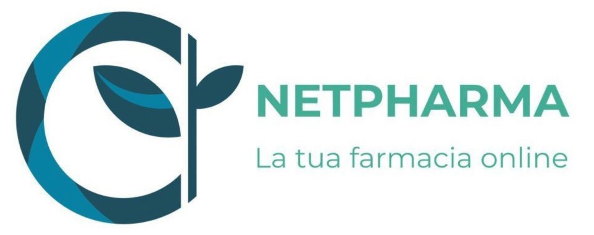

  

 

Project for the Software Engineering course of Computer Science faculty. Academic year 2021/2022 [University of Salerno, Italy][1].

# Project Description 

The work aims to design **NetPharma**, an e-commerce platform for the sale of over-the-counter (OTC) medications, following all the good principles of Software Engineering.
All the documents produced during the development can be found in the [Deliverables](./Deliverables) folder. 
In the [Implementazione](./Implementazione) folder, you will find the code for some of the designed features. 
In the [Database](./Database) folder, you can explore the structure of the database on which we have based our work.

## Authors

* **Sabato Bene**       - [Harley-ux](https://github.com/Harley-ux)
* **Lidia Cozzolino**       - [lcozz](https://github.com/lcozz)
* **Riccardo Napoli**       - [rnapoli00](https://github.com/rnapoli00)
* **Alessandro Penna**      - [a-penna](https://github.com/a-penna)

## Used Technologies

* [Apache Tomcat v9.0](https://tomcat.apache.org/) - Used as a web server. 
* [MySQL v8.0.23](https://www.mysql.com/) - Used as a DBMS.
* [Bootstrap v4.5.2](https://getbootstrap.com/docs/4.6/getting-started/introduction/) - For page styling and responsiveness.
* [Selenium v4.1.2](https://www.selenium.dev/) - For system testing phase.
* [JUnit 5](https://junit.org/junit5/) -  For unit testing of DAOs.
* [Mockito v4.3.1](https://site.mockito.org/) - For unit testing of Servlets.
* [h2 v2.0.202](https://h2database.com/html/main.html) - Used as an in-memory relational DBMS for unit testing phase.

[1] : Being a project for the University of Salerno, all the documentation is written in italian.
